A simple raytracer written in C.

Based on a [raytracer](http://canonical.org/~kragen/sw/aspmisc/raytracer.c) written 
aytracer written by [kragen](http://canonical.org/~kragen/sw/aspmisc/my-very-first-raytracer.html); and on [Ray Tracing in One Weekend](https://raytracing.github.io/books/RayTracingInOneWeekend.html) by Peter Shirley, Trevor David Black, Steve Hollasch.

## Raytracing Progress
---
### Basics (one sphere, on/off color), Rectangular viewport
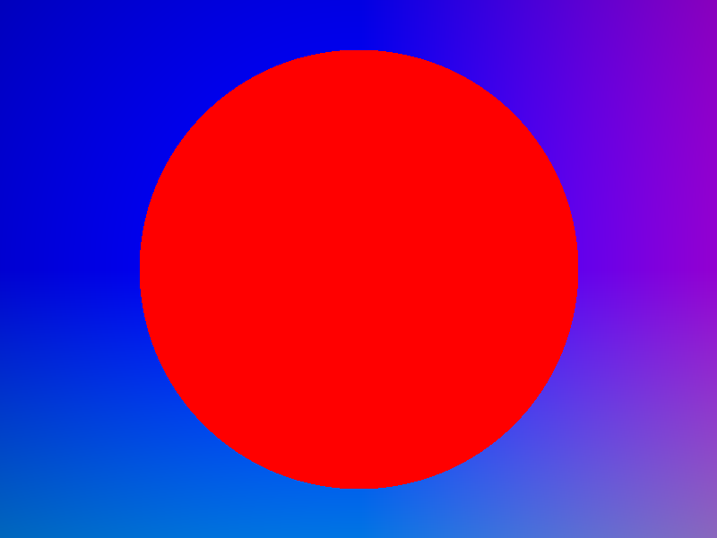 (1s/pix)
---
### Basic coloring based on position ("normals")
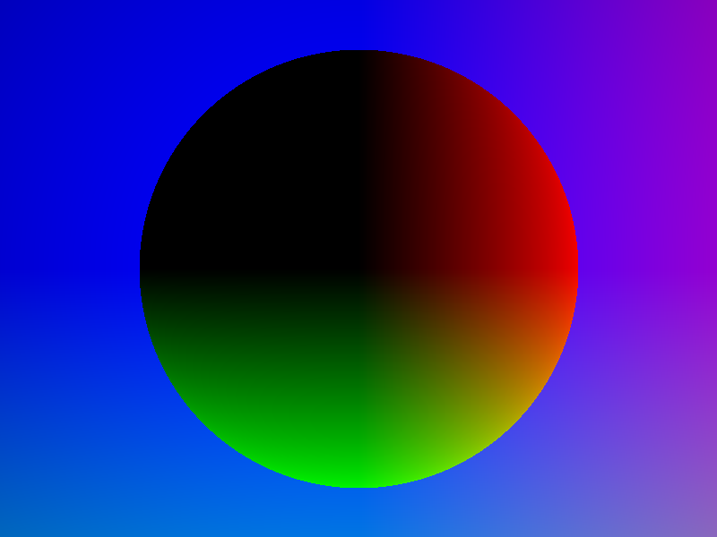 (1s/pix)
---
### Add ground (a big sphere) and two more spheres
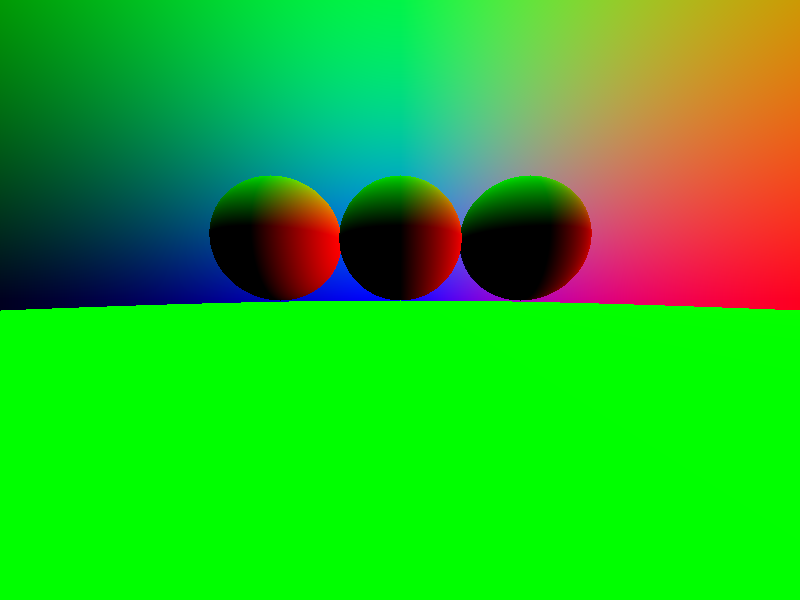 (1s/pix)
---
### Add antialiasing (and accidentally zoom out)
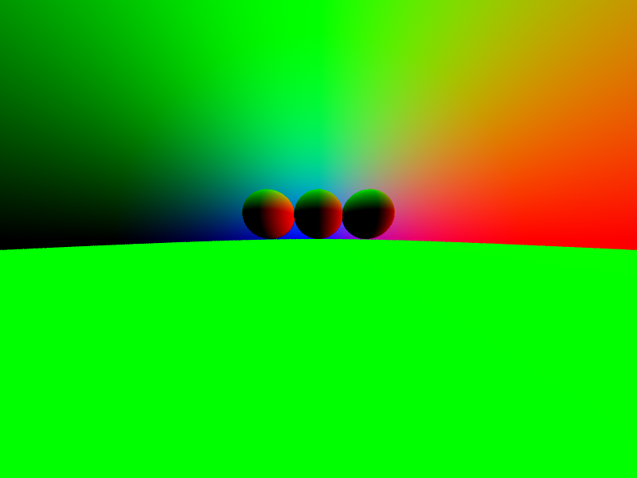 (10s/pix)
---
### Add sky color
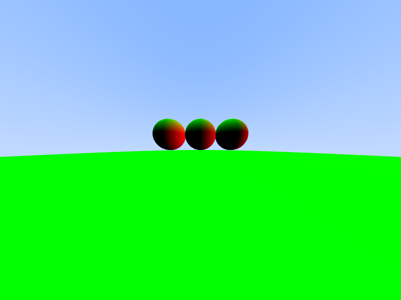 (10s/pix)
---
### Add diffusion
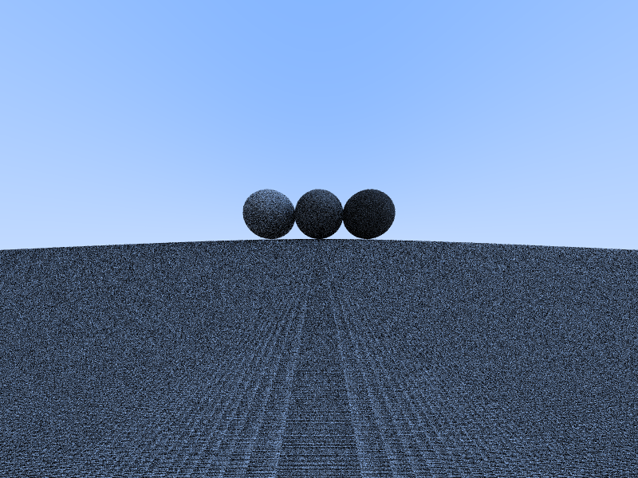 (10s/pix)
---
### Make diffusion more directional (Lambertian diffusion) and zoom back in
 (10s/pix)
---
### Increase (10x) random samples per pixel
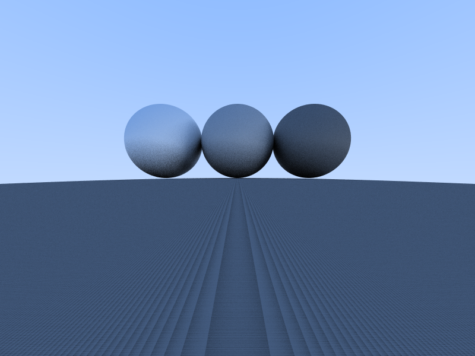 (100s/pix)
---
### Shift camera slightly to not intersect the ground
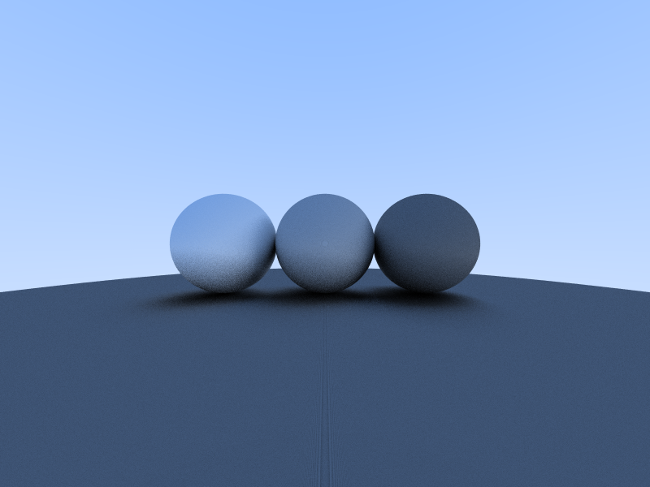 (100s/pix)
---
### Gamma correction
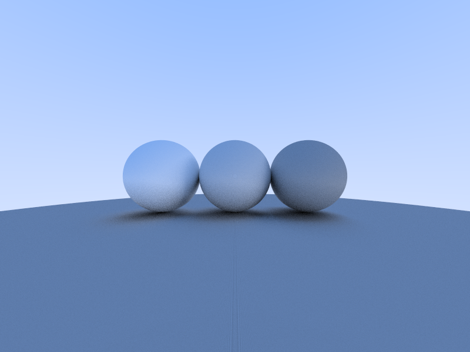 (100s/pix)
---
### Add color to spheres
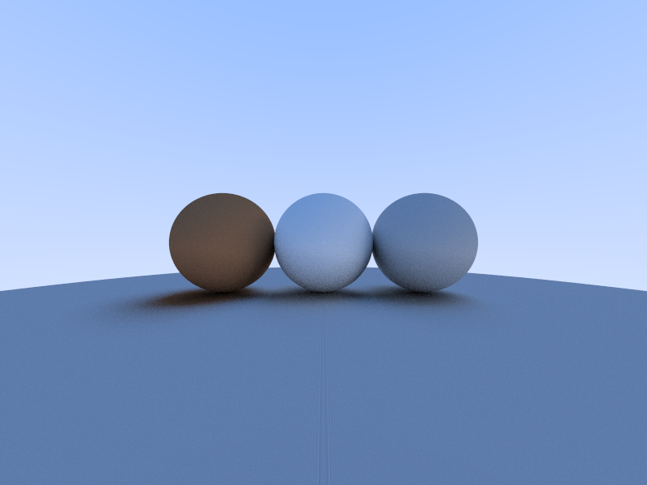 (100s/pix)
---
### Add reflectivity and varied fuzziness parameter
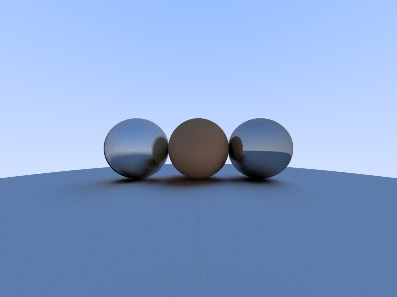 (100s/pix)
---
### Final Scene
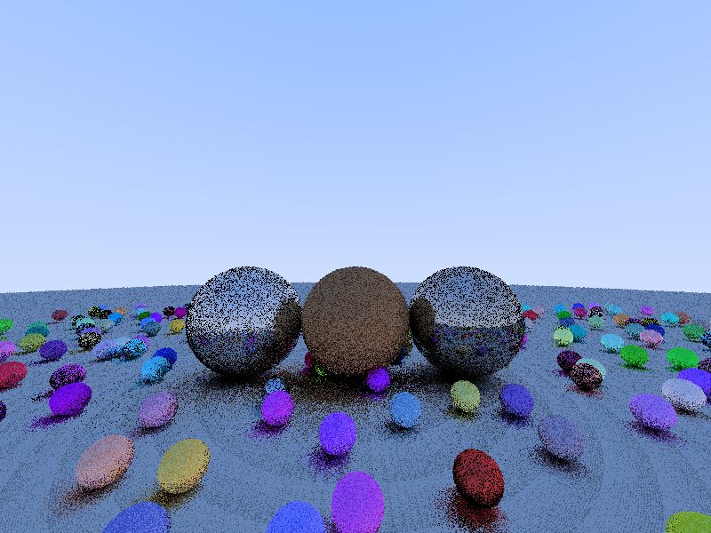 (1s/pix, 2s)  
 (10s/pix, 20s)  
 (100s/pix, 3m24s) 
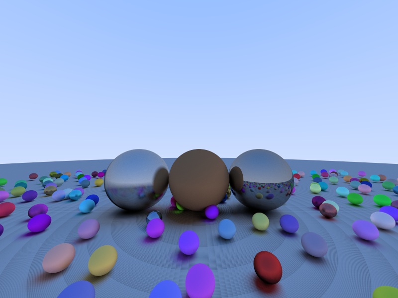 (1000s/pix, 33m)
